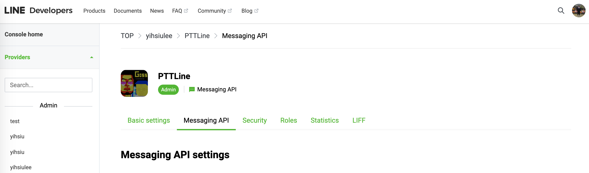
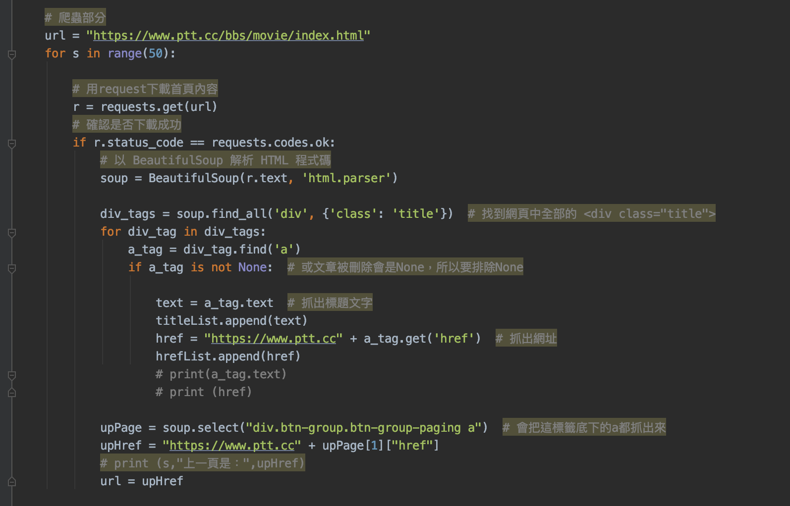
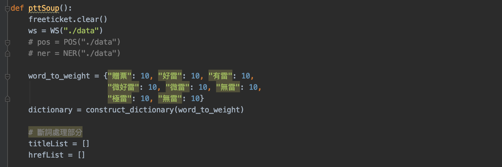
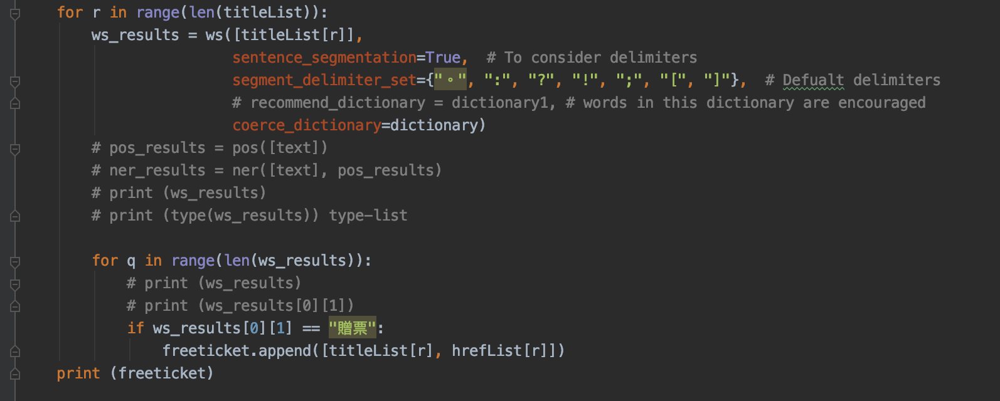
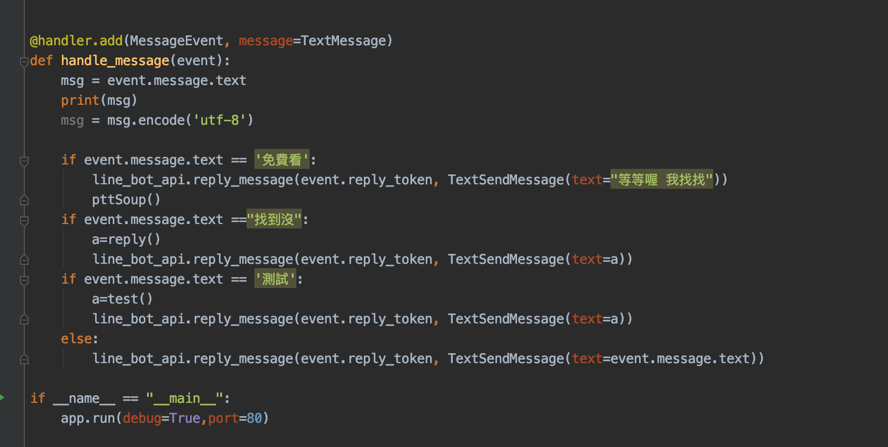

# linebot-CKIP
#### 動機與目的

現代人多數都會使用通訊軟體，像是Line，另一個我常用的軟體則是使用ptt來看論壇上的文章，藉此獲得資訊，在這兩套軟體之間的切換常常會需要耗費不少時間（對現代人來說4-5秒可能就會開始覺得不耐煩了），更不用說是在切換到軟體後，再到內部進行搜尋文章的動作了，所以我決定乾脆就把搜尋ptt文章的功能，透過Linebot 裝到Line上，讓使用者可以直接透過像是與人對話的形式，來取得想要看的文章，也減少中間切換軟體動作所等待的時間。

#### 解決方案

1.先到Line Developers 建立一支機器人，進行基本設定名稱、圖片等。

2.綁定Webhook URL，由於Linebot是一個web service，所以在接收使用者的訊息後，POST給URL接收，透過URL才真的連接到code的內容，也就是實際在處理訊息、整理、選擇要回應什麼內容的地方。

3.Ngrok
由於Line對於綁定的Webhook URL又有嚴格要求，像是URL不能是local host、要有https協定等，所以需要透過Ngrok來將本地端電腦server開啟的local host轉成公開網址，再加上https的協定。

4.Beautifulsoup4-寫個簡單的爬蟲程式!
在這裡我選擇抓ptt的movie板，把50頁內（每一頁10筆）文章的標題與文章網址抓下來，分別丟到兩個List內，再抓的同時也做一些簡單的資料前處理，像是遇到被刪除文章時選擇略過不抓、把網址前面加上https://www.ptt.cc等，方便後續Linebot吐出來後直接能成為一個連結。

5.CKIP斷詞（tensorflow==1.15.0）
因為一開始的想法是透過斷詞來切文章的標題，透過文章的標題來判斷這篇是否為我需要的內容，後來因為效能問題導致一些問題，其實後來有想到有更簡單的做法。

一開始切出來的字因為是一些鄉民用語，比較沒那麼常見，所以也加入一些常見詞進dictionary來增加權重。

斷詞後比對標題內容是否為"贈票"，此時是以抓取贈票標題為例。

6.LineBot
實作處理使用者訊息，當使用者輸入什麼訊息時該如何處理，在這裡是當使用者傳入"免費看"字串時就會call爬蟲的fuction來進行查詢，而輸入"找到沒"會吐出爬出來符合條件，也就是文章標題是贈票的網址。

7.最後透過機器人在Line對話框內吐出使用者所需的資訊

#### 解決成效評析

基本上我自己開出來的需求都有做到，唯一比較大的問題是沒考慮到效能，因為CKIP的斷詞在跑的時候會比較耗費時間，不能即時做出回應，導致line回傳訊息的token超時而失效，Linebot就不會有任何回應，再來另個問題是假設需要上線的話，通常不會用自己的local host當server，這時候可能要推上heroku等，但heroku則是無法讀取靜態文件，所以CKIP在斷詞的時候需要讀入的data檔就會無法讀入，所以其實可以透過split直接根據標點符號切標題來改善這些問題。

#### 結論

簡易爬蟲版的LinePTT完成，可以隨時查詢板上免費贈票的電影，其實也可以再加入其他的版，事先多將一些板的網址存在程式碼中即可，然後使用者輸入的訊息也可以當作一個參數，例如可以提示使用者輸入：A.想看的版 B.想看的標題分類，此時將這兩個條件值丟到爬蟲跟判斷標題的function中，即可根據使用者需求來客製化爬出他們想看的文章了。
